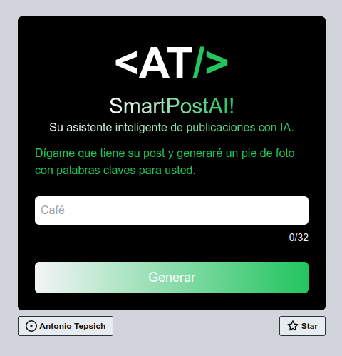

# SmartPostAI: Weekend Project

Esta es una aplicación SaaS que genera fragmentos de marca para post de Instagram con Inteligencia Artificial y palabras clave para la marca del cliente. 
Es una aplicación FullStack creada para saber utilizar la API de OPENAI y desplegar el proyecto en la nube de AWS, dando lugar a una aplicacion de tipo SaaS.

## Trabajo

Pruebalo en la pagina: https://smartpostai.vercel.app/

## Lambda Layer ZIP

He decidido agregar el archivo zip de la capa Lambda junto con el proyecto, ya que a muchas personas se le dificulta construir este tipo de imagen Docker.

Si queres agregar dependencias al proyecto vas a tener que crearlo por vos mismo a la imagen, o si no necesitas usar mas dependencias que las que ya estan, entonces simplemente utiliza el archivo `infrastructure/lambda_base_layer/layer.zip` que he proporcionado.

## Tech Stack

#### Backend Stack

| Type      | Tech                                                         |
| --------- | ------------------------------------------------------------ |
| Language  | [Python](https://www.python.org/)                            |
| Framework | [FastAPI](https://fastapi.tiangolo.com/)                     |
| Hosting   | [AWS](https://aws.amazon.com/) (Lambda + API Gateway)        |
| Other     | [OpenAI](https://openai.com/), [AWS CDK](https://aws.amazon.com/cdk/), [Docker](https://www.docker.com/) |

#### Frontend Stack

| Type      | Tech                                                         |
| --------- | ------------------------------------------------------------ |
| Language  | [Typescript](https://www.typescriptlang.org/)                |
| Framework | [NextJS](https://nextjs.org/) / [React](https://reactjs.org/) |
| Styling   | [TailwindCSS](https://tailwindcss.com/)                      |
| Hosting   | [Vercel](https://vercel.com)                                 |

## 